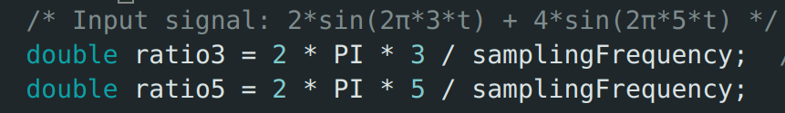
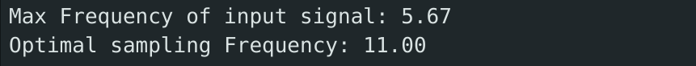
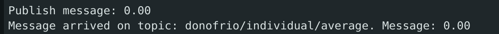
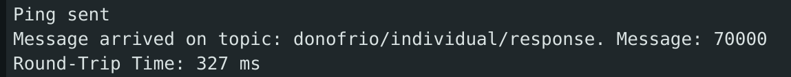
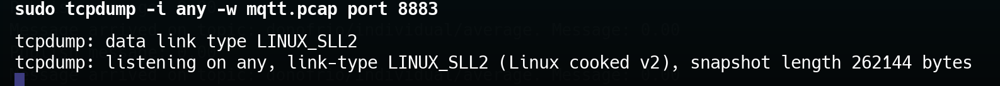
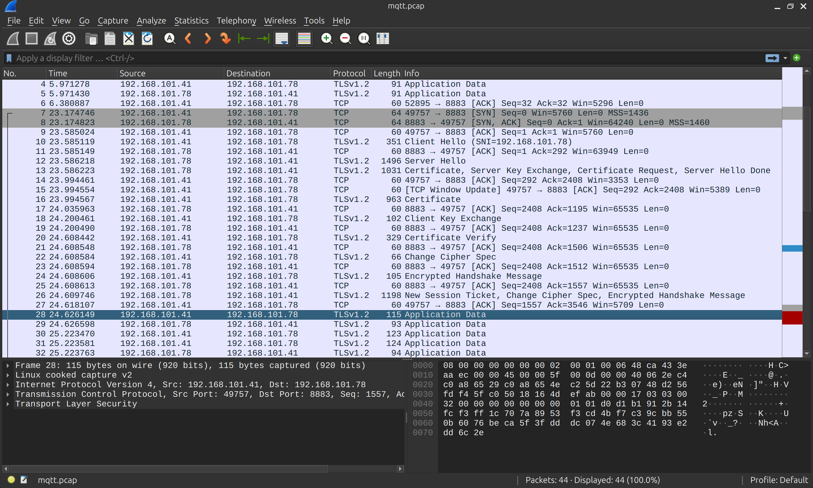

# IoT-Individual-Assignment

Individual Assignment for Internet of Things - Algorithms and Services course

## The assignment
The requirements needed to solve the assignment are:

- Identify the maximum sampling frequency of the device
- Compute correctly the max freq of the input signal
- Compute correctly the optimal freq of the input signal
- Compute correctly the aggregate function over a window
- Evaluate correctly the saving in energy
- Evaluate correctly the communication cost
- Evaluate correctly the end-to-end latency
- Transmit the result to the edge server via MQTT+WIFI 
- Transmit the result to the cloud server via LoRaWAN + TTN 


## Technical Details

### Input Signal
For this assignment i choosed to simulate the input signal with the firmware of my esp32 board. The input signal i generated is composed by two sine waves with different amplitudes and frequencies and it's the following:
```
input_signal(t) = 2*sin(2*pi*3*t)+4*sin(2*pi*5*t)
```
### Maximum Sampling Frequency
The Maximum Sampling Frequency of my esp32 board depends on how we are obtaining the signal. For example if we use the ADC to sample the signal then the maximum sampling frequency will be bound to the ADC's sampling rate. In my case i generate the signal internally in the device so to simulate a sampling rate of a physical device i used a delay that is the minimum delay that can be used in our machine that is: 

```
vTaskDelay(pdMS_TO_TICKS(portTICK_PERIOD_MS));
```

where portTICK_PERIOD_MS is bound to freeRTOS settings and can be also improved but for me the default value is 1ms. With this in mind i simulated the sampling of a signal and stored the start time and end time of this compution and then to find the maximum frequency i used:

```
int maximum_frequency = (int)(count / ((end_time - start_time) / 1000000.0));
```

I divided by 1000000.0 because the functions to get the time gives a microseconds value and i need to convert it in seconds.


The result of this computation is 1000Hz that corrsiponds to the simulated maximum frequency of my device.

### Identify optimal Sampling Frequency

To identify the optimal Sampling Frequency we need to find the maximum frequency of our input signal. To do so we can use the Fourier Transform because ,since our signal is composed by sin and this sin component are only summed but not moltiplicated and so stretched , the highest peak in the frequency domain gives the maximum frequency of the signal in input.

So i used the ArduinoFFT library to compute the majorPeak in the frequency domain. I used as number of samples 512 , because a low number of samples with my sampling frequency that is the maximum possible of 1000Hz would produce a wrong computation because for example with 64 samples the FFT components will be spaced by 1000/64 = 15.62Hz and given that the frequency of our input signal are much lower(3 and 5Hz) then the FFT returns a wrong value of the highest peak. But with 512 samples then the spacing will be 1000/512=1.95Hz and so it computes correctly the highest frequency.

Since we are generating the signal internally we have a discrete time sampling of our signal and so the time is represented as t=i/Fs where i is the sample number and Fs is the frequency of sampling. So the two ratios corresponding to the two sinusoids in input are in the form of: ratio=2*PI*Fi / Fs ,as you can see in the code:



The result of the computation that is the maximum frequency of our input signal is 5.67Hz and that is what we expected. Given this we can compute the optimal Sampling Frequency with the Sampling Theorem that gives that the mimum sampling rate of a signal to be uniformly sampled to reconstruct correctly the original signal is > 2 * Fmax  , in our case 2* 5.67Hz = 11Hz rounded.




### Compute aggregate function over a window

To compute the aggregate function over a window we simulate sampling our generated signal at the optimal sampling Frequency that we just found and given that we are in discrete time to simulate the number of times that we will be sampling the signal in a time windows of 5 seconds is:

```
int samples = (int)(samplingFrequency * time_window);
```

Then we sum each iteration and we keep count of how many iteration we are doing to compute at the end the average value of our signal in a time window of 5 seconds that is:


As expected the average value is 0 because we are generating sinusoidal signal with positive and negative values that eventually will cancel each other.

### Communicate the aggregate value to the nearby server

To communicate the aggregate value to the nearby server we use mqtt and in particular i hosted a mqtt broker on my machine that accepts only certified requests on port 8883. The board needs to store the ca.crt and client.crt and client.key to establish a connection with the mqtt broker. We use a wifi connection to my smartphone hotspot to make all this communication. 

We have two main tasks in the file .ino , the first is void mqtt_send_average to send to this topic: "donofrio/individual/average" the average value computed before and for debug reasons we are also subscribed to this topic. In this topic the value is sended every 10 seconds and the result is this:



I also setup a little nodejs server that connects to the mqtt broker , using the same certificates needed for the connection and this server simply subscribes to the same topic and prints the value received.

The other task we have in the ino file is void round_trip_time , that is used to calculate the end-to-end latency od the system , between the board and the edge server. The result of this task is the Round Trip Time as below:



It simply sends to a specific topic called ping_topic a message with the current timestamp measured by the board , then when the edge server receives the message simply sends immediatly a message on another topic called response_topic. Our board is subscribed to this last topic and so as soon as it receives a message first checks if the value of the message is the same timestamp that he sended , and then calculates the round trip time with the difference between the time in which he sended the message and the time when he recived this other message.

### Communicate the aggregate value to the cloud

We trasmit the average value using lora , we use the lora router present at DIAG to correctly receive the message on The Things Network. 

Using the EzLoraWan library we establish a connection with the ttn server via lora providing the devEUI , AppEUI and appKey registered on the TTN console to recognize our device.  Every 10 seconds of delay we send the message containing our average value and we set up our callback function to print the message in case of downlink communication.


### Communication cost

I used this command to track all the networks operations on the port 8883 that is used by mqtt:



This saves the traffic network registered in the mqtt.pcap file that can be opened with wireshark to analyze the data.



The communication registered by tcpdump consists of sending the average value from the esp32 board to the edge device and as soon as the broker receives the message to forward to all the subscribers the message goes also back to the board that prints the value. This occupies 44 packets of communication , given many acknowledgments done by tsl protocol to encrypt communication , while the application data packets are on average of 100bytes.


## Setup Guide
