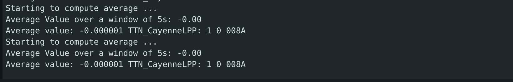

# IoT-Individual-Assignment

Individual Assignment for Internet of Things - Algorithms and Services course 2025

## The assignment
The requirements needed to solve the assignment are:

- Identify the maximum sampling frequency of the device
- Compute correctly the max freq of the input signal
- Compute correctly the optimal freq of the input signal
- Compute correctly the aggregate function over a window
- Evaluate correctly the saving in energy
- Evaluate correctly the communication cost
- Evaluate correctly the end-to-end latency
- Transmit the result to the edge server via MQTT+WIFI 
- Transmit the result to the cloud server via LoRaWAN + TTN 


## Technical Details

### Input Signal
For this assignment i choosed to simulate the input signal with the firmware of my esp32 board. The input signal i generated is composed by two sine waves with different frequencies and it's the following:
```
input_signal(t) = 2*sin(2*pi*3*t)+4*sin(2*pi*5*t)
```
### Maximum Sampling Frequency
The Maximum Sampling Frequency of my esp32 board depends on how we are obtaining the signal. For example if we use the ADC to sample the signal then the maximum sampling frequency will be bound to the ADC's sampling rate. In my case i generate the signal internally in the device so to simulate a sampling rate of a physical device i used a delay that is the minimum delay that can be used in our machine that is: 

```
vTaskDelay(pdMS_TO_TICKS(portTICK_PERIOD_MS));
```

where portTICK_PERIOD_MS is bound to freeRTOS settings and can be also improved but for me the default value is 1ms. With this in mind i simulated the sampling of a signal delayed by this balue and stored the start time and end time of this compution and then to find the maximum frequency possible at which we can sample:

```
int maximum_frequency = (int)(count / ((end_time - start_time) / 1000000.0));
```

I divided by 1000000.0 because the functions to get the time gives a microseconds value and i need to convert it in seconds.


The result of this computation is 1000Hz that corrsiponds to the simulated maximum frequency of my device. So with this result in the maxSamplingFrequency() function we set the original sampling frequency and our current sampling frequency to 1000Hz.

### Identify optimal Sampling Frequency

To identify the maximum frequency of our input signal , since it's a sum of multiple sines we have to compute the maximum frequency ourself knowing the magnitudes because the FFT.majorPeak returns an estimation of the dominant frequency but we need to find the frequency of the last significant peak of magnitudes, that is the maximum frequency of the input signal. 

The library i used is ArduinoFFT library of which the output consists of frequency bins, each representing a range of frequencies. The magnitude of each bin indicates the strength of the signal at that frequency. 
I used as number of samples 512 , because a low number of samples with my sampling frequency that is the maximum sampling frequency calculated before of 1000Hz would produce a wrong computation because for example with 64 samples the FFT computation will produce bins spaced every 1000/64 = 15.62Hz and given that the frequency of our input signal are much lower(3Hz and 5Hz) then the FFT returns a wrong value of the highest peak. But with 512 samples then the spacing will be 1000/512=1.95Hz and so it computes correctly the highest frequency.

So in the maxFrequencyInputSignal function we take a function pointer as parameter , and we pass when we invoke it the input signal. In the function first we get the current Sampling Frequency and then we can compute the delay between each sample in milliseconds and start sampling saving the results in the vReal array.

Since we are generating the signal internally we have a discrete time sampling of our signal and so the time is represented as time=i/samplingFrequency where i is the sample number and samplingFrequency is the frequency of sampling. 

So after that we can compute the FFT and the magnitudes , and then the maximum frequency is computed with  findLastPeakFrequencyWithInterpolation function. This funciton first finds the maximum magnitude computed , then we find a peak with a magnitude of at least 20% of the maximum magnitued. Then it does a parabolic interpolation to find find a more precise peak location . The interpolated bin value is the converted to a frequency , and then the value of the last frequency peak that we keep track of is updated only if the peak is sufficiently far from the previous.


Given this we can compute the optimal Sampling Frequency with the Sampling Theorem that gives that the minimum sampling rate of a signal to be uniformly sampled to reconstruct correctly the original signal is > 2 * maximum Frequency  , in our case 2* 5.67Hz = 11Hz rounded.

### Compute aggregate function over a window

To compute the aggregate function over a window we simulate sampling our generated signal at the optimal sampling Frequency that we just found using the getSamplingFrequency() and given that we are in discrete time to simulate the number of times that we will be sampling the signal in a time windows of 5 seconds we do:

```
int samples = (int)(samplingFrequency * time_window);
```

We have a delay between each sample of: 
```
float delay_between_samples = (1 / samplingFrequency) * 1000;  //in milliseconds
```

Then we sum each iteration and we keep count of how many iteration we are doing to compute at the end the average value of our signal in a time window of 5 seconds that is:


As expected the average value is 0 because we are generating sinusoidal signal with positive and negative values that eventually will cancel each other.

Finally when we have the average value we will send it to the average value queue and then we can delete the task , or if we are doing the computation without deep sleep than we wait an arbitrary value of 10 seconds before starting again the computation of the average. We do this delay of 10 seconds to avoid filling the queue and so to avoid to be blocked by it but it's not a good approach in real case scenarios.

### Communicate the aggregate value to the nearby server

To communicate the aggregate value to the nearby server we use mqtt and in particular i hosted a mqtt broker on my machine that accepts only certified requests on port 8883. The board needs to store the ca.crt and client.crt and client.key to establish a connection with the mqtt broker. We use a wifi connection to my smartphone hotspot to make all this communication.

So this task "mqtt_send_average_sleep" is actually concurrent with the "aggregateFunction" task that computes the average but it's blocked until we receive the average value on the queue. 
As soon as it receives the value it starts the wifi connection and the connection to the mqtt broker and if the connection is successfull it publishes the value on the topic "donofrio/individual/average" , then it disconnects from the mqtt broker and enters deep sleep. 


We can check the message being received on the topic on the little node server that represent the edge server that simply connects to the mqtt broker using the same client certificates needed  , subscribes itself on the "donofrio/individual/average" topic and then simply prints the message received on the topic.


DEEP SLEEP:
We set a timer wakeup before entering deep sleep to 10 seconds and more importantly we have to store in the rtc registry of the board three variables needed to restart the computation when the boards wake ups. We stored only three variables because these are essentials and the rtc registry is very small so we have to choose carefully the variables needed. The first is a simple boolean "isFFTComputed" that is set to true when we finish the FFT computation and we set the optimal sampling frequency , and when we wake up from deep sleep we will skip the FFT computation. The other two variables are the original Sampling Frequency and the optimal Sampling Frequency found in the FFT computation.

### Communicate the aggregate value to the cloud

We trasmit the average value using lora , we use the lora router present at DIAG to correctly receive the message on The Things Network. 

Using the EzLoraWan library we establish a connection with the ttn server via lora providing the devEUI , AppEUI and appKey registered on the TTN console to recognize our device. As soon as the "lora_send_average" task receives the average value from the queue it sends the message containing our average value and we set up our callback function to print the message in case of downlink communication.
To activate the lora communication instead of the mqtt server we have to set the doingLora boolean to true and we have to do set the deepSleepMode to false.




## Performance of the system

### Energy Consumption

To measure energy consumption i used a second esp32 board as the monitor and i've done multiple runs: one using  sampling of input signal to compute the average with a delay of 10 seconds in between computations and send the value to mqtt server , an other one with the original over-sampled frequency to compute the average and the last one with the board entering deep sleep after sending the average value.

Below there is the circuit to measure the power consumption: 


First we have the results of the computation using the sampling of average with an arbitrary delay:


Here we can see clearly the peaks of consumption of nearly 800 mW that are related to the connection to the WiFi , the connection to the mqtt broker , sending the average value and then disconnect from the mqtt broker. After that we have 10 seconds delay before the task aggregateFunction starts again the computation but the energy consumption is the same to when this task is computing the average. This is due to freeRTOS tasks that even when we set vTaskDelay the task is still running and consumes the same amount of energy. Along the wait after sending the value we can see at regular interval small peaks of energy consumption at around 600ms. This is because the board doesn't disconnects from WiFi and so this little peaks should be wifi keep-alive mechanisms using to remain correctly connected to the wifi. 

The results instead of the computation using the over sampled signal are this:


The values of consumption are practically the same and this is expected only in our scenario when we have the two tasks running and even if we have a smaller delay between each sample with this over sample frequency the energy consumption is the same.


Of course in real case scenarios when sampling a real signal a good practice should be to set the esp32 board in deep sleep betwenn each sampling to save as much power as possible. In this scenario it is not possible because of the relatively high frequency in which we are sampling that doesn't give enough time to the board to enter correctly the deep sleep mode and to wake up in time. So to demonstrate the energy savings when the board is in deep sleep we enter deep sleep for arbitrary time of 10 seconds after we sended the average value computed. Then we wake up and we start computing again the average. The energy consumption of the board in deep sleep is about 16mW , so a very small value compared to the consumption of the board when computing.


### Communication cost

I used this command to track all the networks operations on the port 8883 that is used by mqtt:


This saves the traffic network registered in the mqtt.pcap file that can be opened with wireshark to analyze the data.


As we can see here the packets captured by one send through mqtt are 30 packets , the first 2 are relative to a previous sent so they are not considered. The number is relatively high given many acknowledgments done by tsl protocol to encrypt communication , while the application data packets are on average of 100bytes. 
Since we are using a tumbling window implementation the volume of data sent with the oversampling or the optimal sampling is expected to be the same because we send the same amount of data every 5 seconds , regardless of how much we are sampling.

### End-to-end Latency of the system

The other task we have in the communication.cpp file is round_trip_time , that is used to calculate the end-to-end latency of the system , between the board and the edge server. The result of this task is the Round Trip Time as below:


It simply sends to a specific topic called ping_topic a message with the current timestamp measured by the board , then when the edge server receives the message simply sends immediatly a message on another topic called response_topic. Our board is subscribed to this last topic and so as soon as it receives a message first checks if the value of the message is the same timestamp that he sended , and then calculates the round trip time with the difference between the time in which he sended the message and the time when he recived this other message.
The average value is around 300ms as shown above.

## Setup Guide

If we set the doing bonus variable to true than before computing the FFT of the input signal we will compute the FFT of two additional signals and then we resume the computation as default with the input signal.

Bonus Signal 1 is : 

```
2.0 *sin(2 * PI * 10 * t) + sin( 2 * PI * 50 * t) + 5.0 * sin( 2 * PI * 8 * t)
```

For this signal the computed FFT gives the maximum frequency of the sinput signal as 50 Hz and so the optimal sampling Frequency is 100Hz as shown below:


Bonus Signal 2 is : 

```
2.0*sin(2 * PI * 3 * t) + 3.0 * sin( 2 * PI * 250 * t)
```

For this signal the computed FFT gives the maximum frequency of the sinput signal as 250 Hz and so the optimal sampling Frequency is 500Hz as shown below:


Given the nature of this project there are no other significant differences when changing input signals because we are sampling in a fixed time window of 5 secons and we are sending to the server the same value.


## Setup Guide

The final setup for this project is on the src/individal_assignment_complete folder , in which we have all the needed files to run the project on the board. So the things needed to run the project are: 
1. Heltec WiFi Lora esp32 development board
To do power measurements we also need:
2. INA219 sensor
3. another esp32 board to monitor the consumption

So to run correctly the project:
1. Clone the repository
2. Install ArduinoIDE and the following libraries: arduinoFFT , EzLoraWan, PubSubClient.
3. Install Mosquitto MQTT broker on your machine
4. Enter the /edge-server-mqtt folder that contains the file project of the edge server and install the required dependencies with the command: npm install. Then change the values of the certificates for the mqtt connection creating a .env file with the required parameters and change also the mqtt broker URL to yours. When all is done we can start this server with the command: node edge_server.js
5. Connect the board to your machine and upload the /individual_assignment_complete.ino file to it.
6. If needed you can change the boolean variable "doingDeepSleepMode" to run the program with the deep sleep mechanism , so that the board enters deep sleep for 10 seconds after it sended the average value to the mqtt broker or without deep sleep setting the variable to false in which the board computes the average , sends it through the mqtt broker and waits before computing againt the average.

